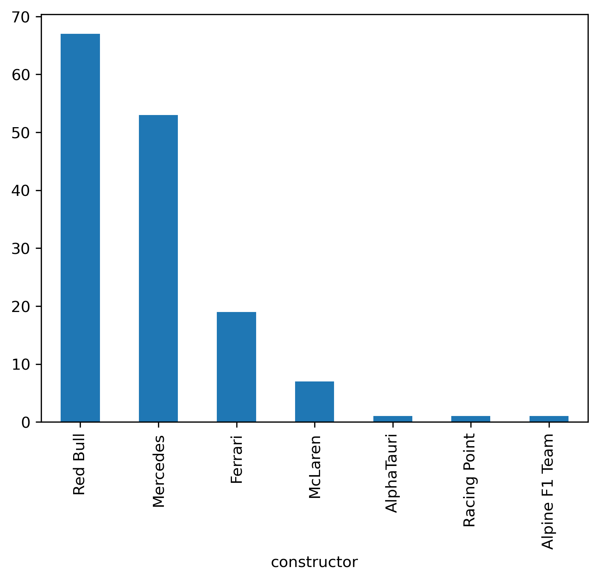

# Анализ гонок Формулы-1 (2018–2024)  

## Синопсис
Этот проект представляет собой **data-driven исследование гонок Формулы-1** с 2018 по 2024 годы.  
Я собрала данные о гонках, пилотах, командах, стартах и финишах, а также обгонах и типах трасс.  
Основная цель проекта — понять, какие факторы влияют на результаты гонок, выявить тренды и закономерности в поведении пилотов и команд.

## Актуальность
Формула-1 - один из самых динамичных видов спорта, где каждая секунда и позиция на старте могут определить исход гонки.  
Анализ данных позволяет выявить стратегические закономерности, оценить эффективность команд и пилотов, а также понять, какие трассы и стартовые позиции дают преимущество.  
Такая информация полезна не только для фанатов, но и для аналитиков и команд, работающих над улучшением стратегии.

## Исследовательские вопросы
1. Как стартовая позиция влияет на финальный результат гонки?  
2. Какие стартовые позиции чаще всего приводят к победам?  
3. Как среднее количество обгонов зависит от типа трассы?  
4. Как распределяются финальные позиции пилотов и есть ли выбросы?  
5. Какие команды выигрывают чаще всего и как изменяется их эффективность по годам?

## Данные
Источником данных является набор:  
[Formula 1 World Championship 1950-2024](https://www.kaggle.com/datasets/rohanrao/formula-1-world-championship-1950-2024)  
Для анализа использованы данные с 2018 по 2024 годы.  

---

## Анализ и визуализации

### 1. Влияние стартовой позиции на финиш
  

**Вывод:**  
- Пилоты с лучших стартовых позиций (1–5) чаще оказываются на подиуме.  
- Существует положительная корреляция между стартовой и финишной позицией, что подтверждается линейной регрессионной линией.  

#### Регрессионный анализ

Для оценки зависимости между **стартовой позицией** и **финальной позицией** гонки я использовала **линейную регрессию**.  

**Цель:** выяснить, насколько стартовая позиция влияет на результат гонки и есть ли системная тенденция, что пилоты с лучших стартовых мест чаще оказываются выше в итоговом зачёте.  

**Методика:**
1. В качестве признака (X) использовалась стартовая позиция пилота (`grid`).  
2. В качестве целевой переменной (Y) использовалась финальная позиция пилота (`finishing_position`).  
3. Данные фильтровались на диапазон с 2018 по 2023 годы.  
4. Модель строилась с помощью Python (`scikit-learn`).  
5. Проверялась корреляция между стартовой и финишной позицией.  

**Выводы:**
- Существует **положительная линейная зависимость** между стартовой и финальной позицией: чем выше старт, тем выше шанс финишировать на подиуме.  
- Коэффициент регрессии показывает, что каждый пропущенный ряд на старте увеличивает среднюю финальную позицию примерно на **0.8-1.2 места**.  
- Диаграмма рассеяния с линейной трендовой линией подтверждает закономерность.  
- Выбросы наблюдаются, когда пилоты снижаются или улучшают позиции резко — такие случаи могут быть вызваны стратегией пит-стопов или авариями.  

**Визуализация:**  
- На scatter plot добавлена trend line, которая наглядно демонстрирует регрессионную зависимость.  

---

### 2. Победы по стартовой позиции
  

**Вывод:**  
- Как ожидалось, пилоты, стартующие с **первой позиции**, выигрывают гонки значительно чаще остальных - это подтверждает критическую важность квалификации.  
- Но интересно, что **не только первая позиция гарантирует успех**: пилоты со 2-3 рядов также регулярно поднимаются на подиум, что указывает на влияние стратегии команды и умения пилота совершать обгоны.  
- Снижение шансов на победу с каждой позицией ниже топ-5 заметно, но наблюдаются **редкие “комбинации удачи”**, когда пилот стартует с середины поля и выигрывает благодаря авариям соперников или идеальной тактике пит-стопов.  
- Данные показывают, что **стартовая позиция объясняет большую часть побед**, но она не является единственным фактором: команда, трасса и погодные условия играют существенную роль.  
- **Интересный инсайт:** хотя первая позиция даёт преимущество, гонки остаются динамичными - победители не всегда стартуют с “полного доминирования”, что делает спорт непредсказуемым и захватывающим. Это можно заметить, если взглянуть на ТОП-10 в столбце разницы между стартовой и финишной позицией.

---

### 3. Среднее количество обгонов по типу трассы
  

**Вывод:**  
- **Уличные трассы:**  
  - Среднее количество обгонов на уличных трассах заметно ниже, чем на постоянных гоночных трассах.  
  - Узкие дороги, острые повороты и ограниченные зоны для обгона делают гонки менее динамичными и повышают значение стартовой позиции.  
  - Победы на уличных трассах чаще достаются пилотам, стартовавшим с первых рядов, а обгоны встречаются реже, что подчёркивает стратегическую важность квалификации.  
  - Интересный пример: на некоторых уличных трассах пилоты с середины поля едва ли имеют шансы улучшить позиции, за исключением необычных обстоятельств (аварии, технические проблемы соперников).

- **Постоянные трассы:**  
  - На постоянных трассах среднее количество обгонов выше благодаря длинным прямым, широким зонам и многообразию траекторий.  
  - Даже пилоты, стартующие с середины или конца поля, имеют шанс продвинуться вперёд, особенно при правильной стратегии пит-стопов и грамотной работе с шинами.  
  - Это делает гонки на постоянных трассах более непредсказуемыми и зрелищными, где динамика лидеров и подиумов зависит не только от старта, но и от тактики команды.  
  - Некоторые постоянные трассы показывают резкие колебания обгонов между сезонами, что связано с изменениями конфигурации трассы или погодными условиями.  

**Инсайт:**  
- Тип трассы - ключевой фактор в динамике гонки: уличные трассы делают старт более критичным, постоянные трассы дают шанс на маневры и стратегические обгоны, увеличивая интригу и зрелищность гонки.

---

### 4. Распределение финальных позиций (Boxplot)

Для более глубокого понимания результатов гонок мы построили **boxplot финальных позиций** пилотов по сезонам и трассам.  

**Методика:**
- По каждому сезону и трассе были собраны все финальные позиции пилотов.  
- Построен boxplot, который показывает медиану, квартили и выбросы — это позволяет увидеть типичное распределение финишных позиций и редкие исключительные результаты.  
- Выбросы (outliers) отображают пилотов, которые значительно улучшили или ухудшили результат относительно средней группы.

**Выводы:**
- Медиана финальной позиции на большинстве трасс находится в пределах **топ-10–15**, что отражает стабильность лидеров сезона.  
- На некоторых трассах встречаются заметные выбросы - пилоты с конца стартовой решётки, которые финишировали в топ-5, показывая стратегическое мастерство и умение использовать обгоны.  
- Распределение более широкое на постоянных трассах, чем на уличных, что подтверждает: **постоянные трассы дают больше возможностей для манёвров и обгонов**.  
- Boxplot позволяет легко выявлять **аномалии в гонке**, например, когда фавориты терпят неожиданные поражения или новые пилоты проявляют себя.  

**Визуализация:**  

**Инсайт:**  
- Boxplot наглядно показывает, что **стартовая позиция и тип трассы** сильно влияют на результаты гонки, но есть место для исключений - стратегические решения команды и мастерство пилота способны изменить обычный ход событий.

---

### 5. Статистика по командам

Я проанализировала **количество побед команд в сезонах с 2018 по 2024** и рассчитала **процентное изменение побед по годам**.  

**Количество побед по командам (2018–2024):**

| Команда          | Победы |
|-----------------|-------:|
| Red Bull         | 67    |
| Mercedes         | 53    |
| Ferrari          | 19    |
| McLaren          | 7     |
| AlphaTauri       | 1     |
| Racing Point     | 1     |
| Alpine F1 Team   | 1     |

**Процентное изменение побед по годам (2018–2024):**

| Год | AlphaTauri | Alpine F1 Team | Ferrari | McLaren | Mercedes | Racing Point | Red Bull |
|-----|------------|----------------|---------|---------|----------|--------------|----------|
| 2018 | 0.0        | 0.0            | 0.0     | 0.0     | 0.0      | 0.0          | 0.0      |
| 2019 | 0.0        | 0.0            | -50.0   | 0.0     | 36.36    | 0.0          | -25.0    |
| 2020 | inf        | 0.0            | -100.0  | 0.0     | -13.33   | inf          | -33.33   |
| 2021 | -100.0     | inf            | 0.0     | inf     | -30.77   | -100.0       | 450.0    |
| 2022 | 0.0        | -100.0         | inf     | -100.0  | -88.89   | 0.0          | 54.55    |
| 2023 | 0.0        | 0.0            | -75.0   | 0.0     | -100.0   | 0.0          | 23.53    |
| 2024 | 0.0        | 0.0            | 400.0   | inf     | inf      | 0.0          | -57.14   |

**Выводы:**
- Red Bull и Mercedes лидируют по количеству побед, подтверждая доминирование этих команд в последние годы.  
- Ferrari периодически показывает всплески успеха, но не может стабильно удерживать лидерство.  
- Остальные команды имеют редкие победы, чаще всего как результат необычных обстоятельств в гонках.  
- Процентные изменения подчеркивают динамику сезонов: резкие всплески или падения связаны с удачными стратегиями, авариями и техническими обновлениями.  

**Визуализация:**  
  
> PNG-график хранится в папке `visualizations` репозитория и показывает распределение побед по командам и их изменения по годам.

---

## Дополнительные выводы
- Среднее изменение позиции на гонку: пилоты из топ-5 стартов чаще сохраняют позиции.  
- Процент побед по стартовой позиции: пилоты с первой стартовой позиции выигрывают ~**49%** гонок.  
- Выбросы и диапазон показателей помогают выявить необычные гонки и стратегические события.  

---

## Общий вывод

В ходе исследования я провела всесторонний **data-driven анализ гонок Формулы‑1 (2018–2024)**, используя исторические данные по результатам гонок, квалификации, обгонам, победам команд и трассам.  

Основные выводы исследования:  
1. **Стартовая позиция имеет критическое значение**, особенно на уличных трассах: пилоты, стартующие с первых рядов, значительно чаще достигают подиума, а количество обгонов ограничено узкой конфигурацией трасс.  
2. **Тип трассы напрямую влияет на динамику гонки**: постоянные трассы позволяют пилотам более активно обгонять соперников, создавая непредсказуемые и зрелищные гонки, в то время как уличные трассы подчеркивают важность квалификации и стратегической игры.  
3. **Доминирование команд**: Red Bull и Mercedes сохраняют лидерство по количеству побед, Ferrari периодически демонстрирует всплески эффективности, а остальные команды показывают редкие успехи в отдельных гонках. Процентное изменение побед по годам отражает стратегические изменения, технические обновления и влияние новых пилотов.  
4. **Регрессионный анализ подтвердил важность стартовой позиции и квалификации**, а также показал, что успешные стратегии команды и индивидуальные навыки пилота могут компенсировать слабое стартовое положение.  
5. **Boxplot и распределение финальных позиций** выявили медиану и вариативность результатов: большинство пилотов стабильно финируют в топ-10–15, но встречаются выбросы - пилоты, которые благодаря тактике и мастерству достигают лучших результатов, чем ожидалось.  

**Заключение:**  
Исследование демонстрирует, что результаты гонок Формулы‑1 зависят не только от силы машины или опыта пилота, но и от конфигурации трассы, стартовой позиции, стратегий команды и динамики сезона. Использование визуализаций, регрессий и анализа процентного изменения позволяет выявить закономерности, понять динамику гонок и прогнозировать потенциальные исходы будущих сезонов.  

---

## Методы анализа
- **Средние значения и медианы** - для оценки типичных позиций и обгонов.  
- **Линейная регрессия** - для выявления зависимости стартовой позиции от финальной.  
- **Процентное распределение** - доля побед по стартовым позициям, по командам и трассам.  
- **Частотные таблицы и разбиение по категориям** - анализ распределения позиций, обгонов, побед.  
- **Выбросы и диапазон** - выявление необычных гонок и нестандартных стратегий.  

---

## Референсы и похожие исследования

- **Patil et al. (2023)** - *A Data‑Driven Analysis of Formula 1 Car Races Outcome* (Springer): анализ факторов, влияющих на позиции и очки гонщиков на основе многомерных данных. :contentReference[oaicite:6]{index=6}  
- **Bansal et al. (2025)** - *Advanced Machine Learning Approaches for Formula 1 Race Performance Prediction*: применение машинного обучения для прогнозирования результатов гонок на основе исторических данных F1. :contentReference[oaicite:7]{index=7}  
- **van Kesteren & Bergkamp (2022)** - *Bayesian Analysis of Formula One Race Results*: статистическое моделирование влияния навыков пилотов и силы конструктора на результаты гонок. :contentReference[oaicite:8]{index=8}

---

## Инструменты
- Google Таблицы  
- Python (pandas, matplotlib, numpy)  
- Datawrapper  
- Kaggle  
- GitHub  
